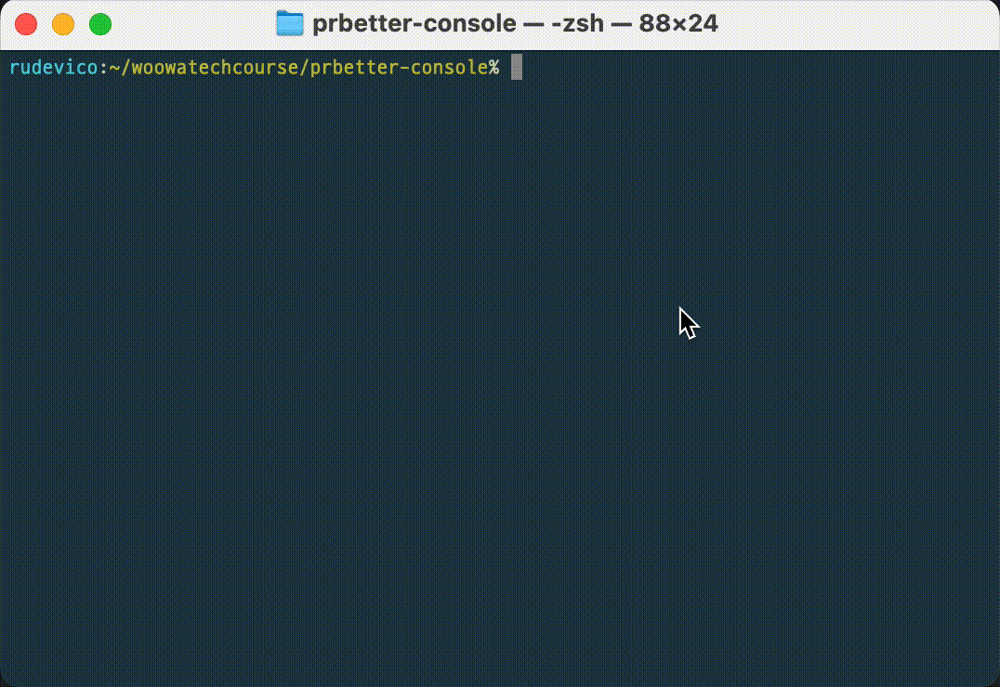
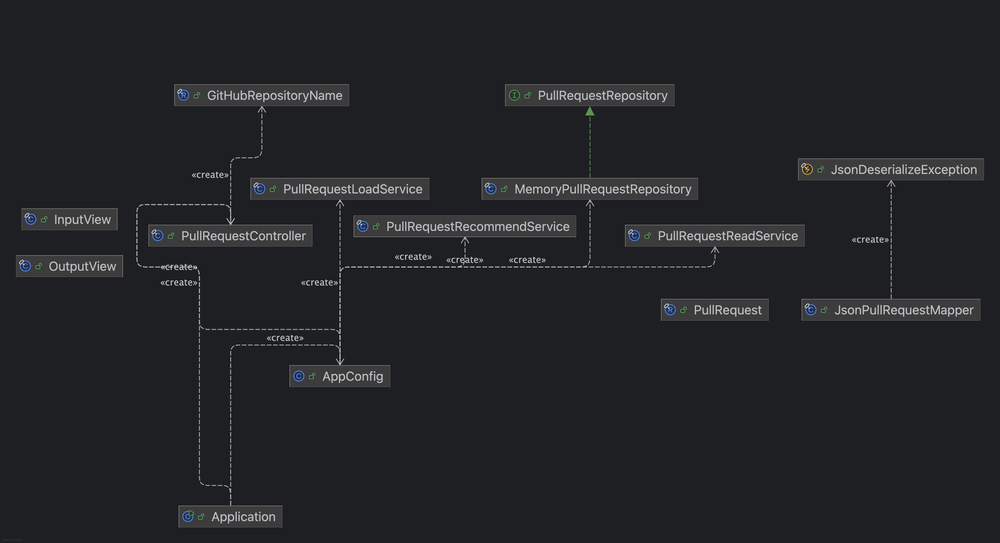
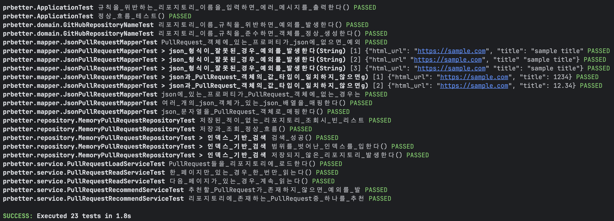
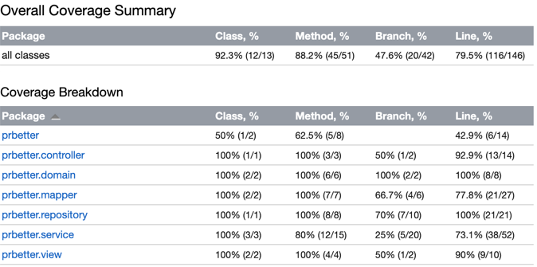

# prbetter-console
### Environment

[](https://www.oracle.com/java/)
[](https://gradle.org/)

### Development
[](https://github.com/woowacourse-projects/mission-utils)
[](https://projectlombok.org/)
[](https://github.com/FasterXML/jackson)

### Testing
[](https://junit.org/junit5/)
[](https://site.mockito.org/)
[](https://github.com/woowacourse-projects/mission-utils)
[](https://htmlpreview.github.io/?https://github.com/HyoYoonNam/prbetter-console/blob/main/htmlReport/index.html)

### Meta
[](https://woowacourse.github.io/)
[](https://opensource.org/licenses/MIT)


#### TODO: javadoc 링크 뱃지 달기

---
**prbetter는 특정 리포지토리에 있는 Pull request 중 하나를 랜덤으로 추천해 주는 콘솔 애플리케이션입니다.**

~~pr을 랜덤으로 뱉어(better)주는 prbetter! 하하....~~

## 📃 목차
[개발 배경](#-개발-배경)  
[사용 예시](#-사용-예시)  
[설치와 사용 방법](#-설치와-사용-방법)  
[주요 기능](#-주요-기능)  
[프로덕션 코드 구조](#-프로덕션-코드-구조)  
[클래스 다이어그램](#-클래스-다이어그램)  
[테스트 결과](#-테스트-결과)  
[더 많은 정보](#-더-많은-정보)

## 💡 개발 배경
우아한테크코스 프리코스(이하 '우테코')에서는 각 미션마다 PR을 날리고, 동료들 사이의 상호 리뷰를 통한 '함께 성장'을 지향해요.

하지만 디스코드 커뮤니티를 통한 기존의 상호 리뷰 시스템에서는 '가장 최근 활동이 일어난 게시글' 순서로 정렬되기 때문에 '리뷰 쏠림' 현상이 발생함을 목격했어요.

(한번 댓글이 달린 게시글은 "리뷰 했어요~", "감사합니다. 저도 리뷰하러 갈게요!", ... 등의 활동이 계속 발생하기 때문에
계속 상단에 정렬될 확률이 높고, 새롭게 리뷰할 게시글을 정하려는 동료들은 자연스럽게 상위 게시글로 찾아갈 확률이 높으므로
'활동이 일어나는 게시글에서만 계속 추가 활동이 일어나는 쏠림 현상이 발생함. 심지어 백엔드의 경우 1,000여 명의 동료들이 있기 때문에 문제가 더욱 심각)

이렇게 <ins>PR 리뷰가 상위 몇 개의 게시글로 쏠릴 수밖에 없는 구조적인 문제</ins>를 개선하면, 동료들이 <ins>더 넓은 범위의 리뷰를 통해 골고루 성장</ins>할 수 있을 것이라는 기대가 있었어요.

**그렇게 생각해 낸 구조적인 문제 개선 방안은 <ins>pr을 랜덤으로 추천</ins>해주는 것이에요!**

## 🎬 사용 예시


## ⚙️ 설치와 사용 방법
> [!WARNING]
>
> - Java 21 이상이 설치되어 있어야 합니다. ([Java 다운로드](https://www.oracle.com/kr/java/technologies/downloads/#java21))
>
> - 내부적으로 [GitHub API - List pull requests](https://docs.github.com/en/rest/pulls/pulls?apiVersion=2022-11-28#list-pull-requests)를
> 사용하므로 [GitHub의 API Rate Limit 정책(시간당 60회)](https://docs.github.com/en/rest/using-the-rest-api/rate-limits-for-the-rest-api?apiVersion=2022-11-28)의 영향을 받습니다.
> 이때 API 호출은 리포지토리에 존재하는 PR 수에 따라 (프로그램 1번 실행마다) 1회 이상 요청될 수 있습니다.

1. [여기](./prbetter.jar)에서 `prbetter.jar` 파일을 다운로드 하세요.
2. 다운로드 한 jar 파일을 실행하세요. 
    ```console
    java -jar prbetter.jar
    ```
3. 프로그램의 안내대로 진행하세요.
    ```console
    % java -jar prbetter.jar
    리포지토리 이름을 입력해 주세요: kotlin lotto 8
    [ERROR] kotlin lotto 8: 깃허브 리포지토리 이름은 ASCII 문자, 숫자, '.', '-', '_' 중 하나여야 합니다.
    
    리포지토리 이름을 입력해 주세요: kotlin-lotto-8
    이 PR을 리뷰해 보세요!
    제목: [로또] rudevico 미션 제출합니다.
    링크: https://github.com/woowacourse-precourse/kotlin-lotto-8/pull/777
    ```

## 🔍 주요 기능
### 입력 값 유효성 검증
GitHub 리포지토리 이름 규칙에 어긋나는 입력은 사전에 차단하여 불필요한 API 호출을 방지합니다.

### 전체 PR 데이터 수집
GitHub API의 pagination을 이용하여, 존재하는 전체 PR 목록을 수집합니다.

### PR 랜덤 추천
수집한 전체 PR 목록에서 하나를 랜덤으로 뽑아 사용자에게 추천하여 리뷰 쏠림 현상을 방지하고, 더 넓은 범위의 동료 성장을 유도합니다.

## 📂 프로덕션 코드 구조
```markdown
% tree src/main/java/prbetter 
src/main/java/prbetter
├── AppConfig.java
├── Application.java ⬅️ 프로그램 진입점
├── controller
│   └── PullRequestController.java
├── domain
│   ├── GitHubRepositoryName.java
│   └── PullRequest.java
├── mapper
│   ├── JsonDeserializeException.java
│   └── JsonPullRequestMapper.java
├── repository
│   ├── MemoryPullRequestRepository.java
│   └── PullRequestRepository.java
├── service
│   ├── PullRequestLoadService.java
│   ├── PullRequestReadService.java
│   └── PullRequestRecommendService.java
└── view
    ├── InputView.java
    └── OutputView.java
```

## 🔀 클래스 다이어그램


## ✅ 테스트 결과
```console
SUCCESS: Executed 23 tests in 1.8s
```



전체 테스트 커버리지는 [여기](https://htmlpreview.github.io/?https://github.com/HyoYoonNam/prbetter-console/blob/main/htmlReport/index.html)에서 확인하실 수 있습니다.


## 💬 더 많은 정보
prbetter를 개발하면서의 설계 과정, 문제와 해결 등은 [노션](https://rudevico.notion.site/2a03a35cb1a180e3a612e6084985a478?source=copy_link)에서 확인할 수 있습니다.
